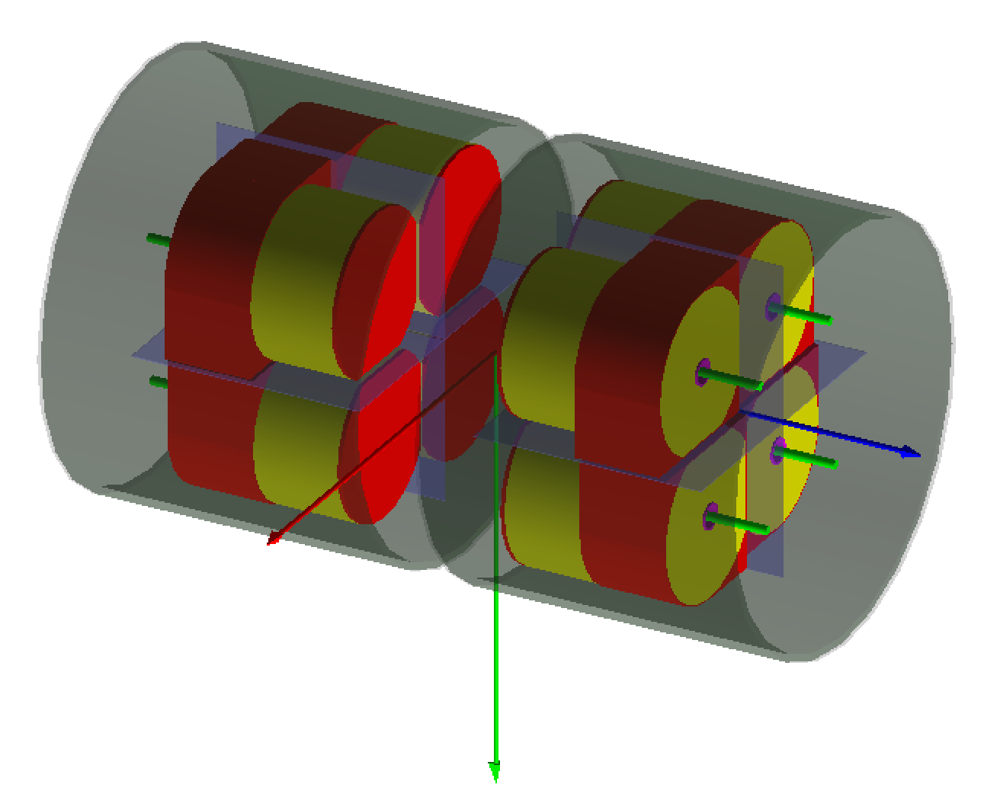

# G4Horus

[](https://doi.org/10.5281/zenodo.3692474)
[](https://travis-ci.org/janmayer/G4Horus)
[](https://app.codacy.com/gh/YanzhaoW/G4Horus/dashboard?utm_source=gh&utm_medium=referral&utm_content=&utm_campaign=Badge_grade)

An implementation of the HORUS High-Purity Germanium (HPGe) γ-ray spectrometer and associated equipment in Geant4.

<!--  -->
<p align="center">

</p>

## Overview

The main goal of this project is to provide an accurate, easy-to-use efficiency simulation for the HORUS setup at the Institute for Nuclear Physics, University of Cologne.

Components:

- Geometries
    - Target Chambers
        - Astro Target Chamber
        - Astro Target Chamber V2
        - SONIC
        - SONIC V3
        - SONIC V3 ΔEE
    - Setups (HPGe Arrays with positions for HPGe Detectors)
        - HORUS (14)
        - Cologne Clover Counting Setup (2)
    - Detectors
        - High-Purity Germanium (HPGe)*
            - Coaxial (default)
            - Clover
            - Encapsulated Hexagonal
        - Bismuth Germanate (BGO) anti-Compton shields
        - (WIP) Passivated Implanted Planar Silicon (PIPS)
    - Auxiliary equipment
        - γ-Filter-Disks
        - (NYI) Passive γ-Supershields
- Actions
    - Event Generators
        - Particle Gun
        - (WIP) Scattering Gun
        - (NYI) Coincidence Gun
        - Cascade Gun
    - Output Formats
        - ROOT Histograms
        - ROOT Ntuples (not recommended)
        - SOCOv2 Events
    - Evaluation
        - Visualization Mode
        - Batch processing Mode
        - Automated efficiency evaluation

\*) Note that each HPGe detector has unique properties, stored in the `DetectorLibrary`, and is referenced by its manufactured ID.

## Getting Started

### Dependencies

- CMake version >= 3.28.1
- [conan](https://docs.conan.io/2/installation.html) version >= 2.0.1
- gcc version >= 13
- [Geant4](https://github.com/Geant4/geant4) version >= 11.2

### Installation

```sh
git clone https://github.com/YanzhaoW/G4Horus.git
cd G4Horus
git submodule init && git submodule update
cmake --workflow --preset default
```

The project should compile successfully.

### Quick Simulation

```shell
cd build
./G4Horus -m ../scripts/batch_default.mac
```

## Usage

All user configurations of this program should be specified in a Geant4 macro file. The executable located in the build folder has two modes: visual mode and batch mode.

### Visual mode

Visual mode provides a graphical overview of detector geometries (Clover detector by default). It does not generate any simulated data.
```shell
./G4Horus -v
```

### Batch mode

Batch mode provides simulated data according to the user configurations defined in a macro file:
```shell
./G4Hours -m [macro_file_path.mac]
```

## Configurations in macro files

Parameters like detector distances or particle energies are set by different commands in a macro file. Some (pre-init) commands can only be used before the initialization command (`/g4horus/init`), such as `output_type` or `distance`. An example of available commands can be found in the file [batch_default.mac](../scripts/batch_default.mac).

### Commands in the macro file
```sh
# Optional. Specifies the output format of the simulation. Must be defined before init.
/g4horus/output/type hist # Available options: [hist, ntuple, soco]. Default: hist

# Optional. Specifies the number of bins in the output histograms
/g4horus/output/hist_bin_num 30000 # Default: 1

# Optional. Specifies the minimal value of the output histograms
/g4horus/output/hist_min 0. MeV # Default: 0 MeV

# Optional. Specifies the maximal value of the output histograms
/g4horus/output/hist_max 3. MeV # Default: 1 MeV

# Required. Specifies the JSON file path of the input decay scheme. 
/g4horus/gun/read_decay_scheme ../test/test.json # Relative or absolute path

# Optional. Specifies the distance between the radiation source and the detector front. Must be defined before init.
/g4horus/detector/distance 1.3 cm # Default: 1.3 cm

# Optional. Specifies the type of the event generator. 
/g4horus/gun/type cascade # Available options: [single, cascade, scattering]. Default: cascade

# Required. initialization
/g4horus/init

# Optional. Specifies the energy (keV) of the decay. Don't specify the unit.
/g4horus/gun/energy 919.337 # Default: 0.

# Optional. emits all decays of a cascade if true and emit a single decay if false.
/g4horus/gun/cascade true # Default: true

# Show the progress per number of events.
/run/printProgress 100
    
# Optional. Set the output file name.
/analysis/setFileName test.root # Default: hist.root

# Required. Set the number of events for the run.
/run/beamOn 1000
```

The generation of the JSON file can be done in this [program](https://github.com/YanzhaoW/NuclearChartConverter).
